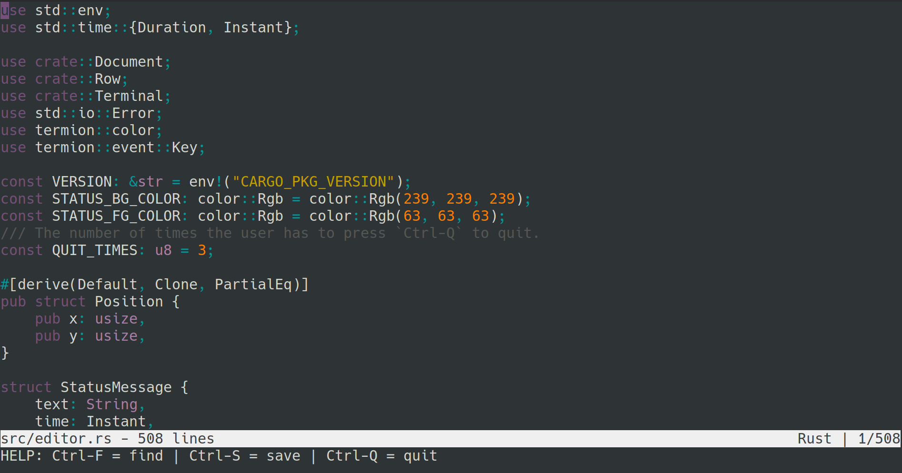

<h1 align="center"><i>Hecto</i></h1>

---

<p align="center">
    <i>Hecto</i> is a basic text editor,
    <br>
    re-implemented in Rust based on the original <a href="http://antirez.com/news/108">kilo</a> editor,
    <br>
    as outlined in <a href="https://viewsourcecode.org/snaptoken/kilo/index.html">Build Your Own Text Editor</a>.
    <br>
    
</p>

## Brief

This project serves as an exercise for me to learn Rust, following the blog post [Hecto: Build your own text editor in Rust](https://www.flenker.blog/hecto/) with modifications.

## Features

- Basic text editing
- Search
- Syntax highlighting

## Getting Started

### Prerequisites

- [Rust](https://www.rust-lang.org/tools/install)

#### Linux

On Linux that uses the X Window System, you need to install the following dependencies:

- `libxcb-shape0-dev`
- `libxcb-xfixes0-dev`

For example, on Ubuntu:

```sh
sudo apt-get install libxcb-shape0-dev libxcb-xfixes0-dev
```

### Installation

1. Clone the repository:

    ```sh
    git clone
    ```

2. Open a file with _Hecto_:

    ```sh
    cargo run --release <file>
    ```

3. (Optional) Install _Hecto_:

    ```sh
    cargo install --path .
    ```

    Then, run _Hecto_:

    ```sh
    hecto <file>
    ```

## Usage

```sh
hecto <file>
```

### Navigation

- **Arrow keys**: Navigate the text.
- **Page Up/Page Down**: Navigate the text by page.
- **Home/End**: Navigate to the beginning/end of the line.

### Editing

- **Backspace**: Delete the character before the cursor.
- **Delete**: Delete the character at the cursor.
- **Enter**: Insert a newline.
- **Tab**: Insert a tab (1 space).

### Commands

- **Ctrl-V**: Paste from the system clipboard.
- **Ctrl-F**: Find, navigate with arrow keys, press Enter to confirm and Esc to cancel.
- **Ctrl-Q**: Quit, requires multiple presses to quit if there are unsaved changes.
- **Ctrl-S**: Save, prompt for a filename if there is no filename associated with the file.

## License

_Hecto_ is licensed under [CC BY 4.0](https://creativecommons.org/licenses/by/4.0/).
